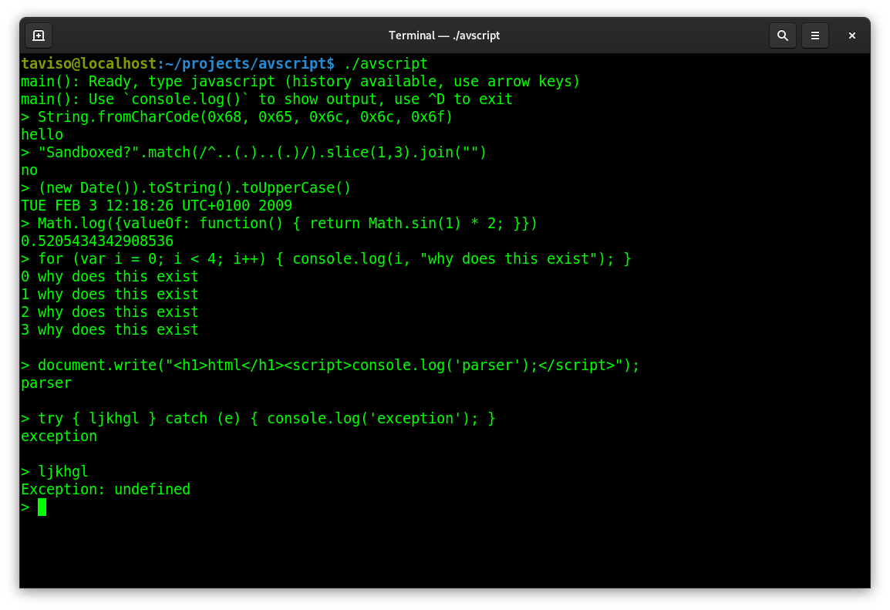
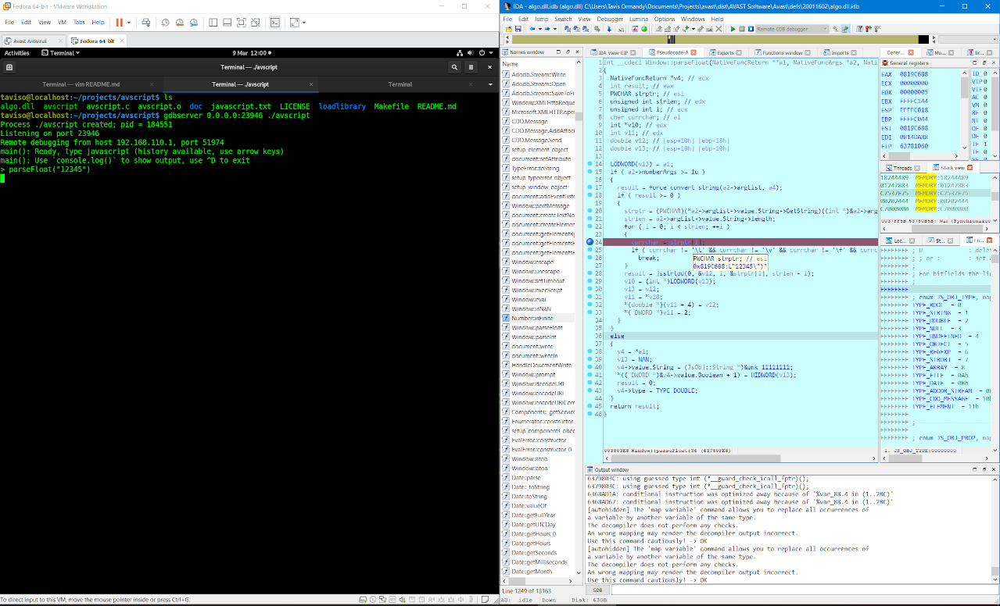

# Avast Antivirus JavaScript Interpreter

The main Avast antivirus process is called AvastSvc.exe, which runs as SYSTEM.


That service loads the low level antivirus engine, and analyzes untrusted data
received from sources like the filesystem minifilter or intercepted network
traffic.

Despite being highly privileged and processing untrusted input by design, it is
unsandboxed and has poor mitigation coverage. Any vulnerabilities in this
process are critical, and easily accessible to remote attackers.

So.. maybe not great that it includes a custom JavaScript interpreter....???? 🙃




This repository contains an interactive shell that lets you test the
interpreter on Linux for vulnerability research.

# Building

Here's how to try it out, first install the dependencies.

#### Ubuntu
```
$ sudo apt install libreadline-dev:i386 libc6-dev-i386 gcc-multilib
```

#### Fedora
```
$ sudo yum install readline-devel.i686 glibc-devel.i686 libgcc.i686
```

Now you can clone this repository.

```
$ git clone https://github.com/taviso/avscript.git
$ cd avscript
$ git submodule update --init --recursive
```

If everything looks good, build it and `avscript` should be ready.

```
$ make
```

# Notes

###  Reproducing Vulnerabilities on Windows

For performance reasons, Avast do not interpret every JavaScript file they
encounter, they use a heuristic to determine if it's necessary. I've found that
appending the file `javascript.txt` included in this repository is enough to
always trigger the heuristic.

For example, if you have found a vulnerability and want to reproduce it on
Windows, you would first do this:

```
$ cat yourtestcase.js javascript.txt > ReproForWindows.js
```

Now verify that it still does what you expect, e.g.

```
$ ./avscript ReproForWindows.js
main(): File ReproForWindows.js` loaded, about to initialize interpreter...
Segmentation fault (core dumped)
```

Then verify the crash reproduced on Windows.

### Protected Process

The Avast service is a protected process, which means debugging it from
userspace is tricky. If you have kd configured, you can simply undo this
and then debugging in userspace works fine.

A quick and easy solution that works on 32-bit is to do this (note that
[PatchGuard](https://en.wikipedia.org/wiki/Kernel_Patch_Protection) won't
permit this on x64).


### Debugging

Avast does not publish any symbols for their engine, but debugging with IDA or gdb
is still possible. There are some notes on debugging Windows code from Linux in
the [loadlibrary documentation](https://github.com/taviso/loadlibrary).

If you want to use IDA, I would recommend using the `gdbserver` backend.

Simply use something like this, you might need to intall the gdbserver package first:

`$ gdbserver 0.0.0.0:23946 ./avscript`

This works surprisingly well, even pseudocode breakpoints work.



### Vulnerabilities

If you find a vulnerability, it is likely **critical** and **wormable**.

🔥 Please [report it](https://www.avast.com/coordinated-vulnerability-disclosure) urgently. 🔥


